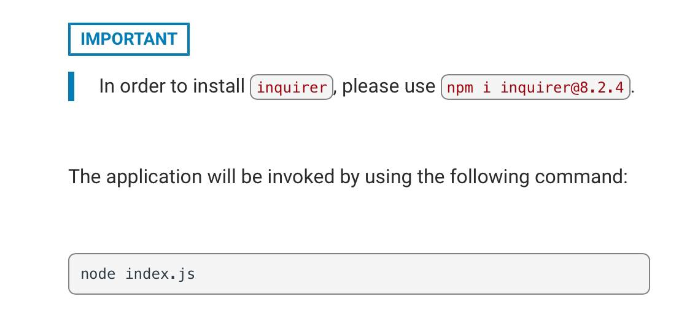

# project-nine-node-readme-generator-challenge
A Readme Generator featuring node and inquirer 8.2.4 command line application

## Description

:page_with_curl:

A readme Generator that uses Node & inquirer 8.2.4. Readme should include: Title, Description, Table of Contents, Installation, Usage, Credits, License, Contribution Guidelines, Tests, Features & Questions. License should be a dropdown list with a ton of licenses to choose from. Badge for license should be added/displayed near top of Readme & a notice is added to License part of Readme explaining which license the application is covered under. Table of contents should be displayed with options, and functional ( meaning it goes to link ) when selected on. Command-line application that accepts user/me  input such as, when user/me enters title for project, title should be displayed in Readme. In questions section, area to enter Github profile ( that when entered should display link to Github Profile ) & section to add email address where if any questions, instructions on how to reach user/me.

## Table of Contents

:bookmark_tabs:

- [Installation](#installation)
- [Starter Code](#starter-code)
- [Links](#links)
- [Credits](#credits)
- [Key-Topics](#key-topics)
- [Node](#nodejs)
- [Modularization](#modularization)
- [NPM](#npm)
- [inquirer](#inquirer)
- [ES6](#es6)
- [Array Methods](#array-methods)
- [Asynchronous JavaScript](#asynchronous-javascript)
- [Tools For This Week](#tools-for-this-week)
- [Full Stack Blog](#full-stack-blog)
- [Screencastify & Video](#screencastify--video)
- [Information About Licensing](#info-about-licenses)
- [MISC](#misc)
- [License](#license)
- [How to Contribute](#how-to-contribute)
- [Badges](#badges)
- [Tests](#tests)
- [Features](#features)

## Installation

:arrow_down:

:arrow_forward:Github Link: https://github.com/pmastropolo/project-nine-read-me-challenege-generator-node

:arrow_forward:Video Link:

## Starter Code

- [Starter Code Link](https://github.com/coding-boot-camp/potential-enigma)
- [Have to use: Inquirer Package](https://www.npmjs.com/package/inquirer/v/8.2.4)

## Links

:open_file_folder:

:arrow_forward:Github link: https://github.com/pmastropolo/project-nine-read-me-challenege-generator-node

:arrow_forward:Video Link:

## Credits

:name_badge:

### Key-Topics

- 
- 
- 

### Node.js

- [Node.js](https://en.wikipedia.org/wiki/Node.js)
- [Process Arg](https://nodejs.org/docs/latest/api/process.html#process_process_argv)
- [FS "File System"](https://node.readthedocs.io/en/latest/api/fs/)

### Modularization

- [Module Require](https://nodejs.org/api/modules.html#modules_require_id)
- [Module Exports](https://nodejs.org/api/modules.html#modules_module_exports)

### NPM

- [Package JSON](https://docs.npmjs.com/creating-a-package-json-file)
- [npm init](https://docs.npmjs.com/cli/v9/commands/npm-init)
- [About NPM](https://docs.npmjs.com/about-npm)
- [Node Modules](https://nodejs.org/api/modules.html#modules_loading_from_node_modules_folders)
- [Terminal Link](https://www.npmjs.com/package/terminal-link)

### inquirer

- [inquirer](https://www.npmjs.com/package/inquirer/v/0.2.3)
- [inq examples](https://github.com/SBoudrias/Inquirer.js/blob/master/packages/inquirer/examples/input.js)

### ES6

- [ES6](https://en.wikipedia.org/wiki/ECMAScript#6th_Edition_%E2%80%93_ECMAScript_2015)
- [let](https://developer.mozilla.org/en-US/docs/Web/JavaScript/Reference/Statements/let)
- [CONST](https://developer.mozilla.org/en-US/docs/Web/JavaScript/Reference/Statements/const)
- [Arrow Functions](https://developer.mozilla.org/en-US/docs/Web/JavaScript/Reference/Functions/Arrow_functions)
- [Template Literals](https://developer.mozilla.org/en-US/docs/Web/JavaScript/Reference/Template_literals)
- [Spread](https://developer.mozilla.org/en-US/docs/Web/JavaScript/Reference/Operators/Spread_syntax)
- [Destructuring assignment](https://developer.mozilla.org/en-US/docs/Web/JavaScript/Reference/Operators/Destructuring_assignment)

### Array Methods

- [Map](https://developer.mozilla.org/en-US/docs/Web/JavaScript/Reference/Global_Objects/Array/map)
- [Filter](https://developer.mozilla.org/en-US/docs/Web/JavaScript/Reference/Global_Objects/Array/filter)
- [Reduce](https://developer.mozilla.org/en-US/docs/Web/JavaScript/Reference/Global_Objects/Array/reduce)

### Asynchronous JavaScript

- [Asynchronous JavaScript](https://developer.mozilla.org/en-US/docs/Learn/JavaScript/Asynchronous)
- [Callbacks](https://developer.mozilla.org/en-US/docs/Glossary/Callback_function)
- [Promises](https://developer.mozilla.org/en-US/docs/Web/JavaScript/Reference/Global_Objects/Promise)

### Tools For This Week

- [Node](https://nodejs.org/en)
- [How to Install NodeJS](https://coding-boot-camp.github.io/full-stack/nodejs/how-to-install-nodejs)
- [NPM](https://www.npmjs.com/)
- [inquirer](https://www.npmjs.com/package/inquirer/v/8.2.4)

### Full Stack Blog

- [Full Stack Blog](https://coding-boot-camp.github.io/full-stack/)
- [How to Install NodeJS](https://coding-boot-camp.github.io/full-stack/nodejs/how-to-install-nodejs)
- [Video Submission Guide](https://coding-boot-camp.github.io/full-stack/computer-literacy/video-submission-guide)

### Screencastify & Video

- [Getting Started, Screencastify](https://learn.screencastify.com/hc/en-us/sections/360008793034-Getting-Started-With-Record)
- [Customize Your Channel, Youtube](https://www.youtube.com/watch?v=-dHIjmQyjFQ&list=PLpjK416fmKwQ42eDY75Q05uM0g3N9WNXU&index=2)
- [Share Files Google Drive](https://support.google.com/drive/answer/2494822?hl=en&co=GENIE.Platform%3DDesktop)
- [Youtube, Share Videos](https://support.google.com/youtube/answer/57741?hl=en&co=GENIE.Platform%3DDesktop)
- [Screencastify, recording troubleshoot](https://learn.screencastify.com/hc/en-us/sections/360008878493-Recording-Troubleshooting)
- [Screencastify](https://www.screencastify.com/)

### Info about Licenses

- [Github Licensing a Repository](https://docs.github.com/en/repositories/managing-your-repositorys-settings-and-features/customizing-your-repository/licensing-a-repository?fbclid=IwAR3zsR8muh-aP_VjZwDjOrZNJTPC5XaX6sbLdFtEBLdYCcGXzceujgMXCZo)
- [Popular Licenses](https://opensource.org/licenses/?categories=popular-strong-community&fbclid=IwAR1Ap02vCfrWrHlx-L3uun0g7XlWxNmzymVwXmJR0zZpIC6EZ7sepe-AwHU)
- [The MIT License](https://opensource.org/license/mit/?fbclid=IwAR25dCW0YdubAhVgFs1VZiwMC3D6yXTV7rrCC1ozEAD7gmptugHF0cB5k0w)
- [Licnesing with inquirer](https://github.com/SBoudrias/Inquirer.js/blob/master/packages/inquirer/examples/list.js)
- [Opensource](https://opensource.org/)
- [Choose A License](https://choosealicense.com/)
- 

### MISC

- [Professional ReadMe Guide](https://coding-boot-camp.github.io/full-stack/github/professional-readme-guide)
- [inquirer](https://www.npmjs.com/package/inquirer/v/8.2.4)
- [Video Submission Guide](https://coding-boot-camp.github.io/full-stack/computer-literacy/video-submission-guide)
- [License Badges](https://shields.io/badges)
- [Apache 2.0](https://opensource.org/license/apache-2-0/)
- [Markdown Guide](https://www.markdownguide.org/)
- [Emojis List](https://gist.github.com/rxaviers/7360908)
- [Contribute Guide](https://github.com/github/docs/blob/4ce10b908b85e3bf19fd8c60bc70da7fc1dade9c/CONTRIBUTING.md)
- [Contributor Covenant](https://www.contributor-covenant.org/)
- [Setting guidelines for repository contributors](https://docs.github.com/en/communities/setting-up-your-project-for-healthy-contributions/setting-guidelines-for-repository-contributors)
- [Write a good readme file](https://www.freecodecamp.org/news/how-to-write-a-good-readme-file/)

## License

:heavy_exclamation_mark:

N/A

## How to Contribute

:tada:

N/A

## Badges

:trophy:

N/A

## Tests

N/A

## Features

:sparkler: